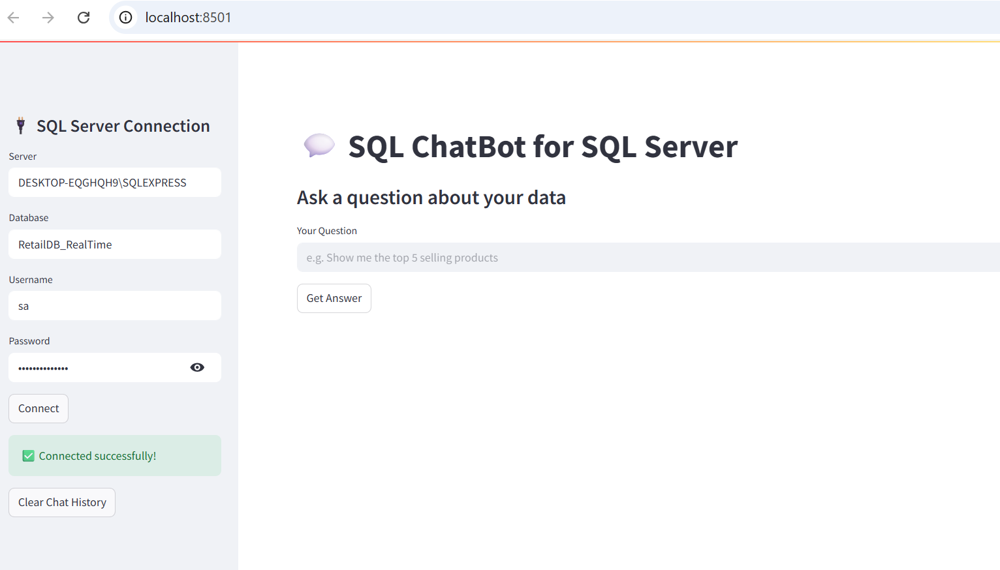
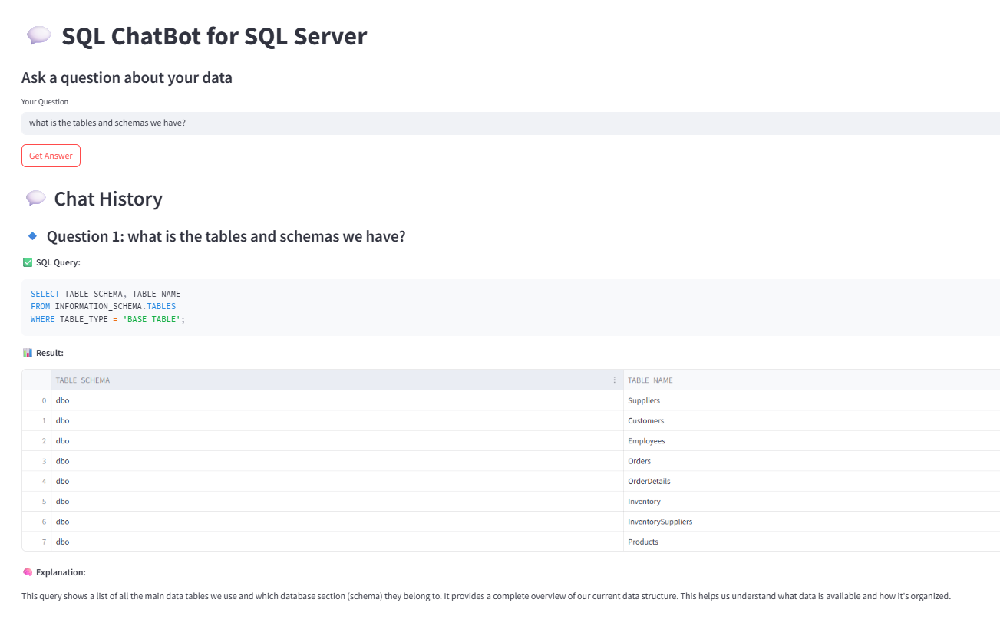
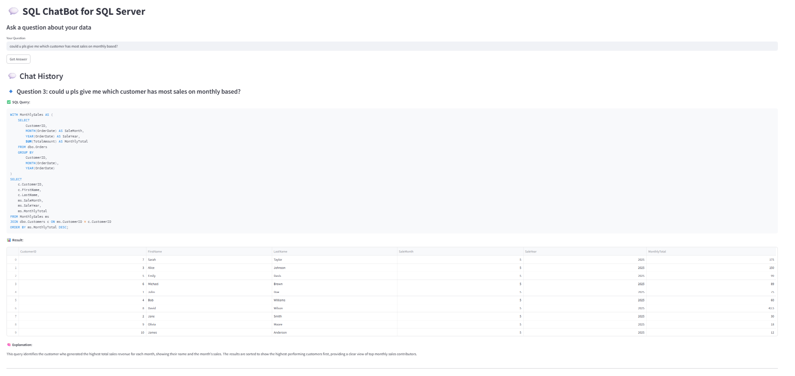

# 🧠 Customer Service ChatBot – Natural Language Interface for Databases

This project is a **Customer Service ChatBot for SQL Server**, built using Python and LangChain, that allows users to interact with an MS SQL database using natural language. It translates user questions into SQL queries, executes them, and returns results – all through a friendly and interactive UI.

---

## 🚀 Features

- 🔗 Connects to **SQL Server** using a connection string (server, username, password).
- 📊 Dynamically queries databases, tables, schemas, and views.
- 💬 Accepts natural language questions (e.g., _"What are the total orders in January?"_).
- 🧠 Uses LangChain to convert questions to SQL queries.
- 📄 Displays generated SQL and query results in a neat interface.
- 🔒 Secure credential handling with `.env` file.
- 🖥️ Interactive **Streamlit-based UI**.

---

## 📁 Folder Structure
```bash
SQL-ChatBot/
│
├── Retail-DB/               # Sample CSV files (optional)
│
├── langchain/               # LangChain prompt setup
│
├── app.py                   # Main UI logic
├── connect.py               # DB connection setup
├── helper.py                # SQL generation logic
├── helper1.py               # Additional utilities
├── prompt.py                # Prompt template (schema + user input)
├── .env                     # Secret DB credentials (not committed)
├── requirements.txt         # Required Python packages
└── README.md                # You're here
```
## 🛠️ Setup Instructions

### 1. Clone the repository

```bash
git clone https://github.com/your-username/sql-server-chatbot.git
cd sql-server-chatbot
```
### 2. Create and activate virtual environment
```bash
python -m venv venv
source venv/bin/activate      # Windows: venv\Scripts\activate
```
### 3. Install dependencies
```bash
pip install -r requirements.txt
```
### 4. Add your database credentials
Create a .env file in the root folder with the following content:
```ini
SERVER=YOUR_SERVER_NAME
DATABASE=YOUR_DATABASE_NAME
USERNAME=your_username
PASSWORD=your_password
```
### ▶️ Run the Application
```bash
streamlit run app.py
```
The app will open in your browser at http://localhost:8501.

%md

## 📘 User Guide

### 🖥️ 1. Connect to SQL Server

1. Open the app in your browser (usually at `http://localhost:8501`)
2. Fill in the following connection details in the sidebar:
   - **Server** (e.g., `DESKTOP-XXXX\SQLEXPRESS`)
   - **Database** (e.g., `RetailDB_RealTime`)
   - **Username**
   - **Password**
3. Click the **"Connect"** button

Once connected successfully, you'll see a confirmation message.

📸 _Connection UI Screenshot Placeholder_  


---

### 💬 2. Ask a Natural Language Question

Enter your question in plain English using the input field, such as:

What are the tables and schemas we have?

Click **"Get Answer"** to generate a query, run it, and view the results.

📸 _Question Input Screenshot Placeholder_  


---

### 📤 3. View Generated SQL + Results + Explanation

After submitting your question:

- ✅ The chatbot **generates a valid SQL query**
- 📊 Executes the query against the connected SQL Server
- 📄 Displays the **query result in a table**
- 🧠 Provides a **business explanation** of the result and query logic

This makes it easy to understand **what** the query does and **why**.

📸 _Results & Explanation Screenshot Placeholder_  


---

### 🧾 4. Chat History (Optional)

All your interactions (questions, queries, results, explanations) are stored and displayed in a chat-like history interface — similar to ChatGPT — helping you track previous insights easily.

📸 _Chat History Screenshot Placeholder_  


---

## ✅ Requirements

- Python 3.7+
- Streamlit
- pyodbc or SQLAlchemy
- LangChain
- OpenAI or Gemini API (via LangChain, optional but recommended)
- `.env` file with secure database credentials

---

## 🔐 Notes

- Ensure your SQL Server is:
  - **Running**
  - **Accessible** over network
  - **Allowing TCP/IP connections**
- For remote access:
  - Configure firewall to open port `1433`
  - Enable **SQL Server Authentication** (not just Windows Auth)
- You can try out the chatbot using the provided sample `Retail-DB` CSVs or your own production database

---

## 🤝 Contributing

We welcome contributions! You can:

- 🔧 Improve SQL prompt engineering
- 🧩 Add support for other databases like **PostgreSQL** or **MySQL**
- 🎨 Enhance the UI with charts, filters, or result export options

---

## 🧱 Built With

- 🐍 Python  
- ⚡ Streamlit  
- 🧠 LangChain  
- 🗄️ Microsoft SQL Server  
- 🤖 OpenAI / Gemini API *(optional for LLMs)*
